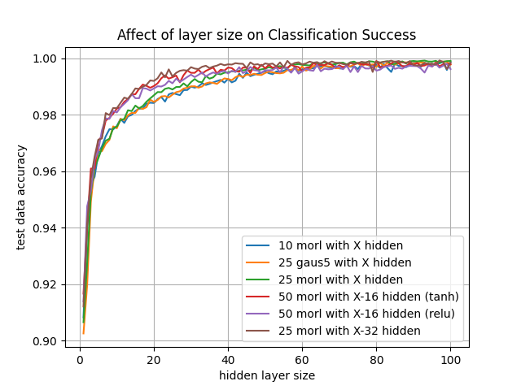

# Classifying heartbeats by applying an artificial neural network to a wavelet decomposition of ECG data.

## Abstract

We develop a method for classifying heartbeat as normal or one of four irregularities by first performing a wavelet decomposition on ECG data and then applying a neural network to classify the heartbeats. We reach a global accuracy of 99.936% correctly classified. We also show that the methodology is robust in that 

## Background

Why do we care about classifying heartbeats?

What is the state of the art?

* ECG heart beat classification method based on modified ABC algorithm
  * Selim Dilmac and Mehmet Korurek
  * Applied Soft Computing (Elsevier)
  * 2015
  * Result:
    * Overall: 99.30% success rate (we get 99.94%)
    * Balanced numbers of each class: 97.96% (we get 98.97%)
* Automatic Classification of Heartbeats Using ECG Signals via Higher Order Hidden Markov Model
  * Ying Liao, Yisha Xiang, and Dongpin Du
  * IEEE International Conference of Automation Science and Engineering
  * 2020
  * Result:
    * Normal: 100% of 20/60 normal heartbeats tested Normal (2 others also did) (we get 99.99% of 18084)
    * Overall: 88.33% (we get 99.94%)
    * Normal vs Abnormal: 92.5% (we get 99.96%)

What is a wavelet decomposition?

* Similar to Fourier transform accept the waves fall off over time.
* Since the wavelets are not waves, frequency and wavelength are not well defined, so use scale instead.
  * time series data gets decomposed into a wavelet that is scaled in the time direction to a particular scale.
  * For each scale used, at each timepoint an intensity (check wording) is assigned.
* Decomposition of time series data looks like a matrix of intensities where each row corresponds to a different scale and each column corresponds to a different time

Where else are wavelet decompositions used?

* Detection of QRS complexes (central portion of the beat)
  * Combining Algorithms in Automatic Detection of QRS Complexes in ECG Signals
    * Carsten Meyer, Jose' Ferna'ndez, and Matthew Harris
    * IEEE Transactions of Information Technology in Biomedicine
    * 2006
  * Efficient automota detection of QRS complexes in ECG signal based on reverse biorthogonal wavelet decomposition and nonlinear filtering
    * Kholkhal Mourad, Bereski Reguig Fethi
    * Measurement (Elsevier)
    * 2016
* Detecting variation in heartrate
  * Embedded System Based on an ARM Microcontroller to Analyze Heart Rate Variability in Real Time Using Wavelets
    * Victor H. Rodriguez, Carlos Medrano, and Inmaculada Plaza
    * Hindawi: Wireless Communication and Mobile Computing (Wiley)
    * 2018

## Method

Using the MITBIH data set that is pre-partitioned into a training and test set, we first perform a wavelet decomposition using the pywt module.
* Data form:
  * timeseries for 1 full heartbeat
  * zeroes padding out to 150 points
  * A number to indicate the heartbeat classification
* Process followed:
  * Separated the classification digit from the end
  * Trimmed trailing zeroes from data
  * Decompose the timeseries using 16 scales

  * Perform the decomposition with each of the following wavelets
    * Morlet        (morl)
    * Mexican Hat   (mexh)
    * real Gaussian (gaus5)

  * Linearly interpolate between the datapoint at each scale to get each of the following lengths
    * 10 datapoints (at 16 scales)
    * 25 datapoints (at 16 scales)
    * 50 datapoints (at 16 scales)
    * 75 datapoints (at 16 scales)

  * Linearize the datapoints by building an array of the k datapoints for the first scale followed by the k datapoints for the second scale etc.

Once the data had been preprocessed, we used scikit-learn to run an artificial neural network with a variety of parameters.
* All combinations of the following parameters were tested on each combination of pre-processed data
  * hidden layers: (100), (100,16), (50,32), (50,32,4)
  * activation function: tanh, relu
  * alpha 0.01, 0.0001, 0.00001
* On some data we also ran other alpha values and larger hidden layers

## Results

After running 350 different combinations of pre-processed data and neural network parameters, we found that on the test data we got:

* All 349/350 correctly classified at least .97 of the heartbeats
* All 327/350 correctly classified at least .98 of the heartbeats
* All 226/350 correctly classified at least .99 of the heartbeats
* All 116/350 correctly classified at least .995 of the heartbeats
* All 3/350 correctly classified at least .999 of the heartbeats
* The best run correctly classified .99936 of the heartbeats. This run had:
  * Morlet wavelets used for the decomposition
  * Data scaled to 25 timepoints
  * A single hidden layer with 100 nodes in the neural network
  * A tanh activation function
  * alpha = 1e-05
* This best run had the following mismatch table:

|	|N	|S	|V	|F	|Q	|
| ----- | ----- | ----- | ----- | ----- | ----- |
|N	|18083	|0	|0	|1	|0	|
|S	|0	|535	|0	|0	|0	|
|V	|0	|0	|1472	|5	|0	|
|F	|8	|0	|0	|164	|0	|
|Q	|0	|0	|0	|0	|162	|

Note: each row is the correct classification, each column is the classification given by the neural network.

We then repeated the neural network training 20 times for several of the top parameter combinations and saw that they each reproduced quite well. We use this data to determine how well the neural network performs.

For data points above the \(y=x\) line the neural network performed better on the test data than the training data. Thus, the distance above the \(y=x\) line gives an estimate of the how far off a perfectly trained neural network will be from the \(y=x\) line. In our case, the points seem clustered similar distances above and below this line indicating that the neural network is neither over-, nor under-trained.

Repeating the process 20 times gave an improvement one time. This training model correctly classified .99941 of the heartbeats. These repeated runs had:
  * Morlet wavelets used for the decomposition
  * Data scaled to 25 timepoints
  * A single hidden layer with 100 nodes in the neural network
  * A tanh activation function
  * alpha = 5e-05
* The following mismatch table:

|	|N	|S	|V	|F	|Q	|
| ----- | ----- | ----- | ----- | ----- | ----- |
|N	|18082	|1	|0	|1	|0	|
|S	|1	|534	|0	|0	|0	|
|V	|0	|0	|1476	|1	|0	|
|F	|9	|0	|0	|163	|0	|
|Q	|0	|0	|0	|0	|162	|

We also repeated the process increasing hidden layer sizes from 1 to 100 by ones to see how small the hidden layer sizes could be before we had diminishing returns.

It is worth noting that the neural network converges on its best possible result faster when a second hidden layer of 16 or 32 nodes is added. However, this addition does not improve the final result.
